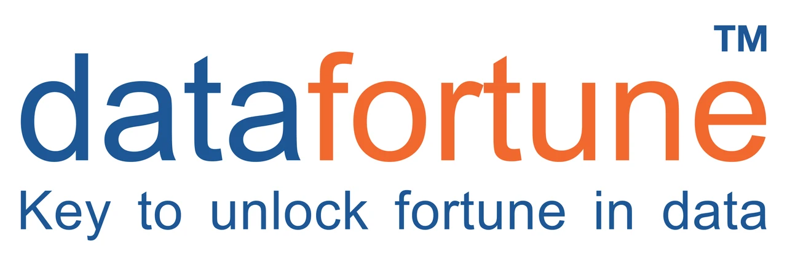

<!DOCTYPE html>
<html lang="en">
<head>
    <meta charset="UTF-8">
    <title>Ram Chapke Portfolio</title>
    <meta name="viewport" content="width=device-width, initial-scale=1.0">

    <!-- AOS Animation -->
    <link rel="stylesheet" href="https://cdnjs.cloudflare.com/ajax/libs/aos/2.3.4/aos.css">
    

    
</head>

<body>

<canvas id="rainCanvas"></canvas>

    

    

    <h1>Ram Chapke</h1>
    
<em>“In the symphony of financial excellence, the best accountants are the conductors of prosperity.”</em>

    <h2 data-aos="fade-up">Professional Experience</h2>

    

        <h3>Datafortune Software Solution</h3>
        
    

    

        <h3>Sahyadri Hospitals Pvt Ltd.</h3>
        
    

    

        <h3>JNP Associates</h3>
        
    

    <h2 data-aos="fade-left">Skills</h2>
    <ul class="grid-list">
        <li>Accounting</li>
        <li>Financial Modelling</li>
        <li>Budgeting</li>
        <li>Financial Planning</li>
        <li>Investment Banking</li>
    </ul>

    <h2 data-aos="fade-right">Hobbies</h2>
    <ul class="grid-list">
        <li>Travelling</li>
        <li>Programming</li>
        <li>Research</li>
        <li>Technology</li>
    </ul>

    <h2>Software & Tools Known</h2>

    

        <button onclick="toggleInfo('accounting')">📊 Accounting</button>
        <button onclick="toggleInfo('office')">🧠 Productivity</button>
        <button onclick="toggleInfo('tech')">💻 Tech</button>
    

    

        <ul>
            <li>Tally Prime</li>
            <li>Zoho Books</li>
            <li>GST Portal</li>
        </ul>
    

    

        <ul>
            <li>Advanced Excel</li>
            <li>Google Sheets</li>
            <li>MS Office</li>
        </ul>
    

    

        <ul>
            <li>GitHub</li>
            <li>HTML, CSS, JavaScript</li>
        </ul>
    

</body>
</html>
